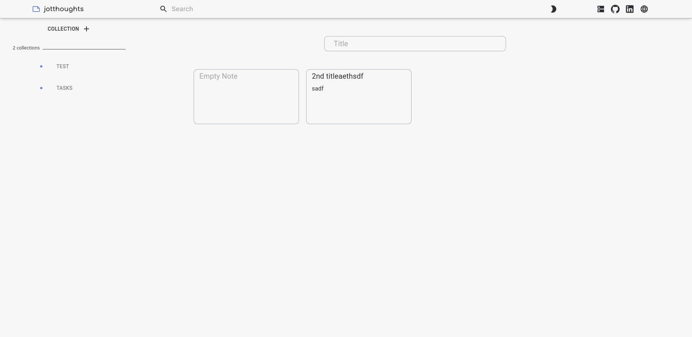
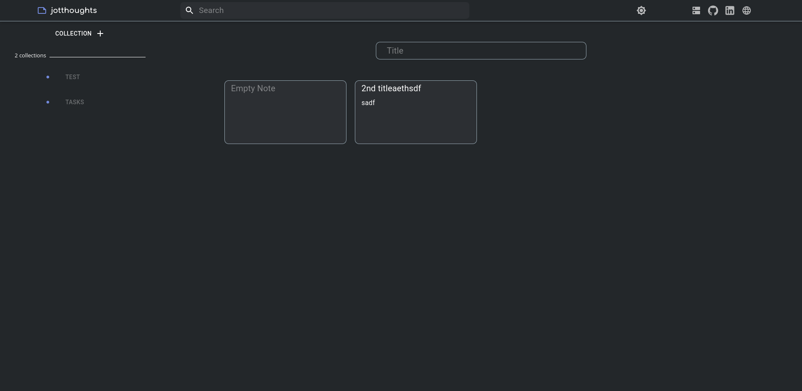

# Jotthoughts

### This is a copy of the Google Keep application that I built. Users can create collections and create notes within these collections. It features both a card and list view for notes, a dark and light theme, and a search feature. There is no authentication as it's meant for demo purposes, but that would be the next step if I were to move this into production.

---

## Technologies

### Frontend

- React
- Redux
- SASS
- React-Router
- Material UI
- Axios

### Backend

- Supabase (this is an awesome alternative to Firebase!)
- PostgresQL
- Node
- Express

---

## Screenshots

### Light Theme

### Dark Theme

